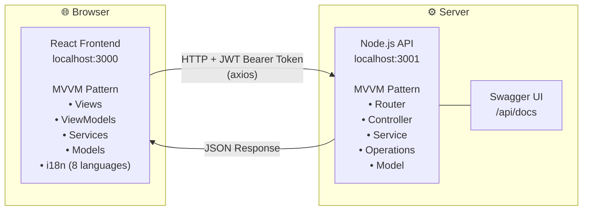

# Unit Converter

Full-stack unit conversion application built with React/TypeScript (frontend) and Node.js/Express/TypeScript (backend). Supports 6 conversion categories, 8 languages, and includes JWT authentication, OpenAPI documentation, Jest unit tests, and Cypress E2E tests.

---

## Repositories

| Project | Path | Description |
|---------|------|-------------|
| **Frontend** | [`unit-converter-frontend/`](./unit-converter-frontend/) | React TypeScript app with MVVM architecture |
| **Backend API** | [`unit-converter-api/`](./unit-converter-api/) | Node.js/Express REST API with JWT auth |

---

## Quick Start

### 1. Start the API
```bash
cd unit-converter-api
npm install
npm run dev
# API runs at http://localhost:3001
# Swagger docs at http://localhost:3001/api/docs
```

### 2. Start the Frontend
```bash
cd unit-converter-frontend
npm install --legacy-peer-deps
npm start
# App runs at http://localhost:3000
```

---

## Architecture Overview



---

## Tech Stack

### Frontend
- **React 19** + **TypeScript**
- **i18next** — 8 languages
- **Axios** — API communication with JWT
- **Jest** + **React Testing Library** — unit/integration tests
- **Cypress** — end-to-end tests
- **CSS Custom Properties** — design system

### Backend
- **Node.js** + **Express 5** + **TypeScript**
- **jsonwebtoken** — JWT authentication
- **swagger-ui-express** — OpenAPI docs
- **helmet** + **cors** — security
- **Jest** + **Supertest** — unit/integration tests

---

## Conversion Categories

| Category | Units |
|----------|-------|
| Length | Meter, Kilometer, Centimeter, Millimeter, Micrometer, Nanometer, Mile, Yard, Foot, Inch, Light Year |
| Temperature | Celsius, Kelvin, Fahrenheit |
| Area | Square Meter, Square Kilometer, Square Centimeter, Square Millimeter, Square Micrometer, Hectare, Square Mile, Square Yard, Square Foot, Square Inch, Acre |
| Volume | Cubic Meter, Cubic Kilometer, Cubic Centimeter, Cubic Millimeter, Liter, Milliliter, US Gallon, US Quart, US Pint, US Cup, US Fluid Ounce |
| Weight | Kilogram, Gram, Milligram, Metric Ton, Long Ton, Short Ton, Pound, Ounce, Carat, Atomic Mass Unit |
| Time | Second, Millisecond, Microsecond, Nanosecond, Picosecond, Minute, Hour, Day, Week, Month, Year |

---

## Testing

### Backend (82 tests)
```bash
cd unit-converter-api && npm test
```

### Frontend (13 unit tests + 42 E2E tests)
```bash
cd unit-converter-frontend && npm test
cd unit-converter-frontend && npm run cypress:run
```

---

## Further Documentation

- [Backend API README](./unit-converter-api/README.md) — API endpoints, auth, architecture diagram, sequence diagram
- [Frontend README](./unit-converter-frontend/README.md) — Component structure, i18n, architecture diagram, sequence diagram
- [OpenAPI Docs](http://localhost:3001/api/docs) — Interactive Swagger UI (when API is running)
