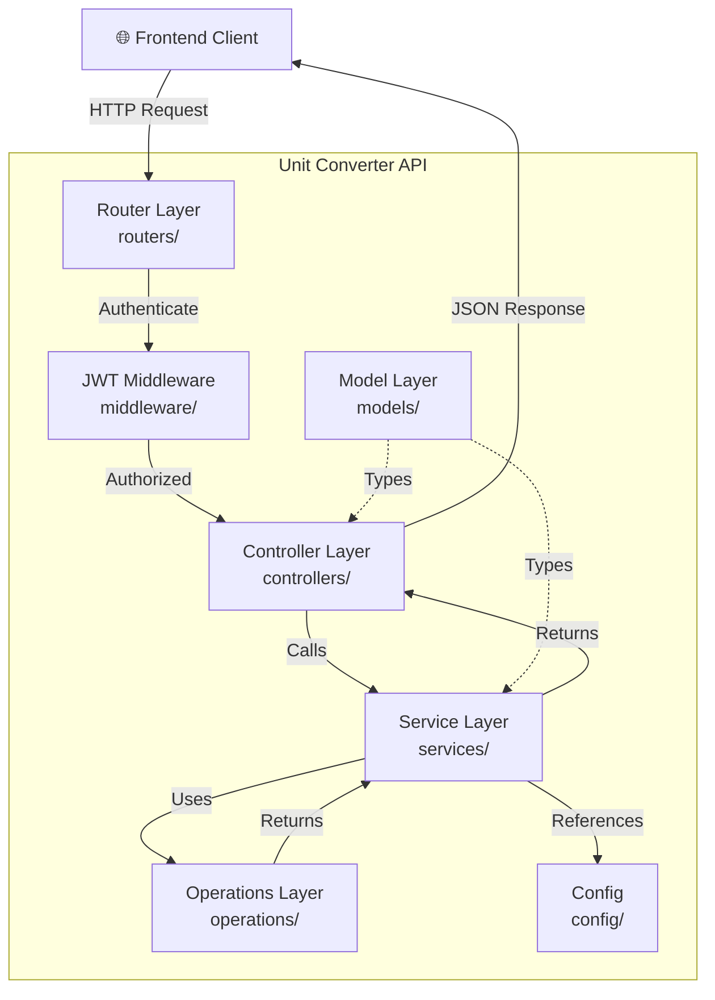
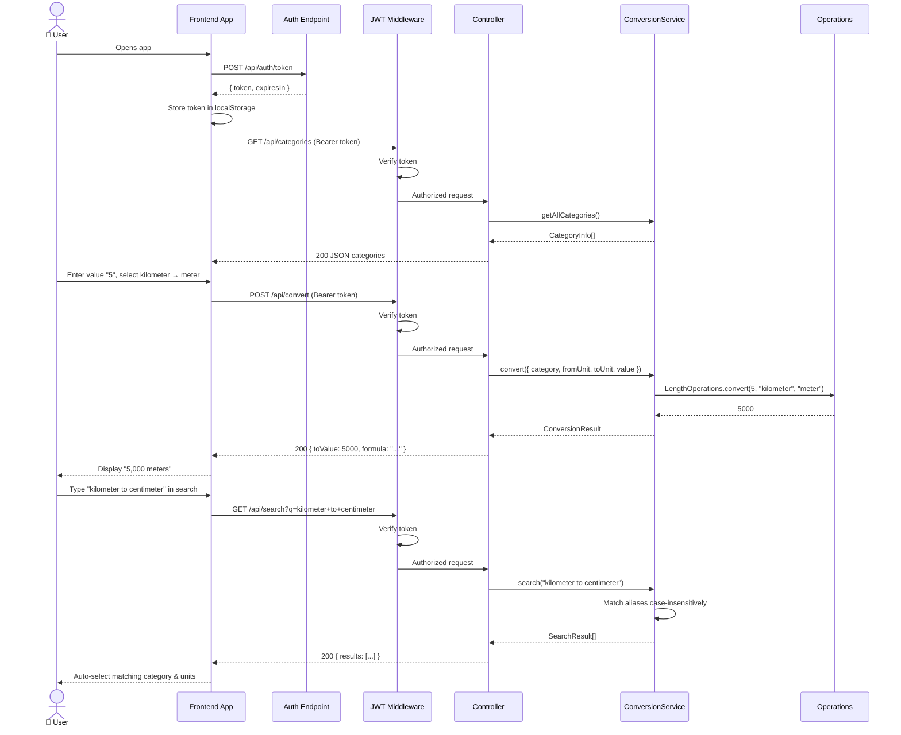

# Unit Converter API

RESTful Node.js API for unit conversions built with Express and TypeScript. Implements the **MVVM architecture** with Model, Service, Controller, and Router layers.

---

## Table of Contents
- [Architecture](#architecture)
- [Project Structure](#project-structure)
- [API Documentation](#api-documentation)
- [Authentication](#authentication)
- [Supported Conversions](#supported-conversions)
- [Getting Started](#getting-started)
- [Running Tests](#running-tests)
- [Sequence Diagram](#sequence-diagram)

---

## Architecture

The API follows a layered MVVM pattern:



---

## Project Structure

```
unit-converter-api/
├── src/
│   ├── models/
│   │   └── ConversionRequest.ts     # Data models and interfaces
│   ├── services/
│   │   ├── ConversionService.ts     # Core conversion orchestration
│   │   └── AuthService.ts           # JWT authentication logic
│   ├── controllers/
│   │   ├── ConversionController.ts  # HTTP request handlers
│   │   └── AuthController.ts        # Auth endpoint handlers
│   ├── routers/
│   │   ├── conversionRouter.ts      # Conversion API routes
│   │   └── authRouter.ts            # Auth routes
│   ├── middleware/
│   │   └── authMiddleware.ts        # JWT bearer token middleware
│   ├── operations/
│   │   ├── lengthOperations.ts      # Length conversion formulas
│   │   ├── temperatureOperations.ts # Temperature conversion formulas
│   │   ├── areaOperations.ts        # Area conversion formulas
│   │   ├── volumeOperations.ts      # Volume conversion formulas
│   │   ├── weightOperations.ts      # Weight conversion formulas
│   │   └── timeOperations.ts        # Time conversion formulas
│   ├── config/
│   │   ├── units.ts                 # Unit definitions and aliases (multilingual)
│   │   └── openapi.ts               # OpenAPI 3.0 specification
│   ├── __tests__/
│   │   ├── operations.test.ts       # Unit tests for all operations
│   │   ├── conversionService.test.ts# Unit tests for ConversionService
│   │   ├── authService.test.ts      # Unit tests for AuthService
│   │   └── api.test.ts              # Integration tests for API endpoints
│   ├── app.ts                       # Express app setup
│   └── server.ts                    # Server entry point
├── .env                             # Environment variables
├── .gitignore
├── tsconfig.json
├── package.json
└── README.md
```

---

## API Documentation

OpenAPI (Swagger UI) docs are available at:  
**`http://localhost:3001/api/docs`**

### Endpoints

| Method | Path | Auth | Description |
|--------|------|------|-------------|
| `POST` | `/api/auth/token` | No | Generate JWT token |
| `GET` | `/api/categories` | Yes | Get all categories |
| `GET` | `/api/categories/:category` | Yes | Get units for a category |
| `POST` | `/api/convert` | Yes | Perform conversion |
| `GET` | `/api/search?q=` | Yes | Search by natural language |
| `GET` | `/health` | No | Health check |

---

## Authentication

All conversion endpoints require a **JWT Bearer token**.

### 1. Get a token:
```bash
curl -X POST http://localhost:3001/api/auth/token \
  -H "Content-Type: application/json" \
  -d '{"clientId": "my-app"}'
```

Response:
```json
{
  "token": "eyJhbGciOiJIUzI1NiIsInR5cCI6IkpXVCJ9...",
  "expiresIn": "24h",
  "tokenType": "Bearer"
}
```

### 2. Use the token:
```bash
curl -X POST http://localhost:3001/api/convert \
  -H "Authorization: Bearer <token>" \
  -H "Content-Type: application/json" \
  -d '{"category": "length", "fromUnit": "kilometer", "toUnit": "meter", "value": 5}'
```

---

## Supported Conversions

| Category | Units |
|----------|-------|
| **Length** | Meter, Kilometer, Centimeter, Millimeter, Micrometer, Nanometer, Mile, Yard, Foot, Inch, Light Year |
| **Temperature** | Celsius, Kelvin, Fahrenheit |
| **Area** | Square Meter, Square Kilometer, Square Centimeter, Square Millimeter, Square Micrometer, Hectare, Square Mile, Square Yard, Square Foot, Square Inch, Acre |
| **Volume** | Cubic Meter, Cubic Kilometer, Cubic Centimeter, Cubic Millimeter, Liter, Milliliter, US Gallon, US Quart, US Pint, US Cup, US Fluid Ounce |
| **Weight** | Kilogram, Gram, Milligram, Metric Ton, Long Ton, Short Ton, Pound, Ounce, Carat, Atomic Mass Unit |
| **Time** | Second, Millisecond, Microsecond, Nanosecond, Picosecond, Minute, Hour, Day, Week, Month, Year |

---

## Getting Started

### Prerequisites
- Node.js >= 18
- npm >= 9

### Install dependencies
```bash
npm install
```

### Configure environment
```bash
cp .env.example .env
# Edit .env with your settings
```

Environment variables:
| Variable | Default | Description |
|----------|---------|-------------|
| `PORT` | `3001` | Server port |
| `JWT_SECRET` | `unit_converter_super_secret_jwt_key_2024` | JWT signing secret |
| `JWT_EXPIRES_IN` | `24h` | Token expiry |
| `CORS_ORIGIN` | `http://localhost:3000` | Allowed CORS origin |

### Development
```bash
npm run dev
```

### Production build
```bash
npm run build
npm start
```

---

## Running Tests

```bash
# Run all tests with coverage
npm test

# Type-check only
npm run lint
```

Test results: **82 tests, 100% pass rate**

---

## Sequence Diagram


